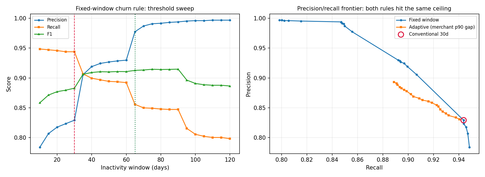
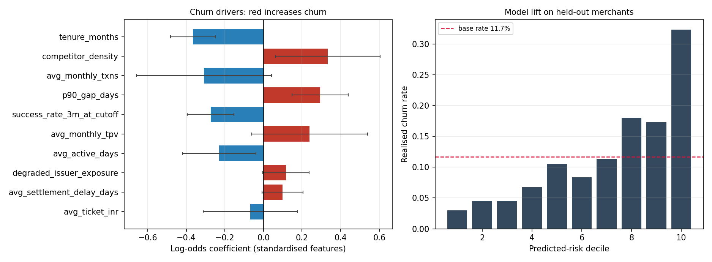

# Silent Churn: merchant retention analytics for a UPI acceptance network

SQL-first analysis of a simulated Indian payments network — **7.4M payment
attempts, 6,000 merchants, 24 months** — that asks one question: *which merchants
are quietly leaving, why, and what is it worth?*

The interesting part is not the model. It is that the standard way of measuring
churn is wrong in a specific, measurable way, and this repo measures it.

> **[📊 Live demo](https://upi-merchant-churn-analytics-n9cukg5fxx5xxtb8pxuink.streamlit.app/)** — interactive
walkthrough of the findings below. It reads the committed analysis outputs in
`reports/`; it does not regenerate data or refit models.

```bash
pip install -r requirements.txt
make data        # ~30s, generates 7.4M transactions
make warehouse   # runs sql/*.sql in order into DuckDB
make analysis    # metric evaluation, drivers, segmentation, forecast
make test
make dashboard   # Streamlit demo — works without the three steps above
```

---

## Headline findings

**The 30-day churn rule overstates churn by 17%, and 99% of the error is one population.**

Treating a churn definition as a classifier and scoring it against a known
answer key:

| rule | flagged | false positives | precision | recall | F1 |
|---|---|---|---|---|---|
| conventional 30-day | 1,721 | 294 | 0.829 | 0.944 | 0.883 |
| best fixed window (90d) | 1,289 | 8 | 0.994 | 0.847 | 0.915 |
| adaptive (×6 merchant p90 gap) | 1,505 | 161 | 0.893 | 0.889 | 0.891 |

294 merchants flagged as churned were still alive, and **99% of them were
dormant-but-alive** — quiet for a month or two, then back.

The result I expected was that a per-merchant adaptive threshold would win. It
barely does. A dormant merchant and a churned merchant are behaviourally
identical at the observation instant, so *no recency-only rule* escapes the
precision ceiling. The fix is structural, not mathematical: a two-tier metric
with a confirmation lag.

> **AT RISK** — 30 days silent — recall 0.944 — drives outreach
> **CONFIRMED** — 65 days silent — precision 0.977 — drives reporting



**Growth masked the whole thing.** Active merchants rose 3,338 → 4,270 and TPV
₹48M → ₹111M straight through a six-month incident, because onboarding outran
attrition every month. Nothing in the top line moved.

**The worst issuer is not the issuer that matters.** Network success rate fell
93.0% → 89.4% and recovered. Ranked by *average success rate*, the worst bank is
a small regional one at 84.6%. Ranked by *volume-weighted contribution to network
success rate*, it causes about one-ninth the damage of a large public-sector
issuer that only ranks second on raw rate.

| issuer | avg success rate | volume share | cumulative rate effect | rank by worst SR | rank by network impact |
|---|---|---|---|---|---|
| SBI | 0.8719 | 19.1% | **−0.2129** | 2 | **1** |
| RRB_GRAMIN | 0.8457 | 4.6% | −0.0236 | **1** | 2 |

Merchants in the top exposure decile churned at **19.4%** vs **14.0%** in the
bottom, with success rate falling monotonically 92.8% → 84.7% across deciles.

---

## What each piece does

```
config/params.yml              every simulation + analysis parameter
src/generate_data.py           the data-generating process
sql/00_schema.sql              parquet bindings (the only engine-specific file)
sql/01_merchant_month_facts    merchant-month + merchant-bank-month grains
sql/02_churn_definitions       three competing definitions, side by side
sql/03_cohort_retention        cohort triangle + the aggregate that hides it
sql/04_incident_diagnosis      SR decomposition into rate vs mix effects
sql/05_merchant_features       modelling table, temporally split
sql/06_revenue_at_risk         three different money numbers, kept separate
src/evaluate_churn_definition  scores definitions against the answer key
src/churn_drivers.py           logistic regression + GBM benchmark
src/segmentation.py            k-means with silhouette-chosen k
src/forecast.py                TPV forecast with a structural break
tests/test_pipeline.py         guardrails against silent wrongness
reports/memo.md                the one-page version for a stakeholder
dashboard/README.md            BI layer specification
app.py                         Streamlit demo over the committed reports/ outputs
```

---

## The dashboard

`app.py` is a presentation layer and nothing else. It reads the CSV and JSON
artefacts already committed under `reports/` — the same ones a BI tool would
consume — and renders four tabs: **Overview**, **Churn & cohorts**, **Merchant
segmentation**, **ML & forecast**. It fits no model, runs no SQL and never
touches the DuckDB warehouse, so it starts instantly and stays consistent with
the numbers in this README by construction rather than by coincidence.

That split is the point: dashboards should consume modelled tables, not raw
transactions. A BI tool doing its own joins over 7.4M rows is how you end up
with four dashboards that each report a different number for the same metric.
`dashboard/README.md` remains the full BI-layer spec; the Streamlit app
implements the subset of it that the committed artefacts can support.

```bash
pip install -r requirements.txt
streamlit run app.py          # or: make dashboard
```

Runs from a clean clone with no pipeline execution. Run `make data warehouse
analysis` first only if you want to regenerate the underlying artefacts.

### Deploying to Streamlit Community Cloud

1. Push the repo to GitHub with `reports/` committed (it already is).
2. At [share.streamlit.io](https://share.streamlit.io), **Create app** → pick
   this repository, branch `main`, main file path `app.py`.
3. Deploy. Dependencies come from `requirements.txt`; the theme comes from
   `.streamlit/config.toml`. No secrets and no environment variables are needed.
4. Paste the resulting URL into the **Live demo** link at the top of this file.

`data/raw/` and `data/warehouse.duckdb` stay gitignored — the deployed app does
not need them.

---

## Why synthetic data, and how it is kept honest

Real merchant-level payments data is not public. Rather than analyse a
pre-aggregated open dataset — PhonePe Pulse has no transaction grain, so cohort
retention, RFM and churn are all impossible on it — this generates a network
with an explicit, documented data-generating process.

That is a real weakness and it is worth being direct about it: synthetic data
cannot surprise you the way real data does. What it *can* do is provide a
counterfactual, which is what makes the central result measurable at all. You
cannot score a churn definition without knowing who actually churned.

Three properties make the analysis non-trivial rather than circular:

**Confounding.** City tier drives payer-side issuer mix *and* competitor density
*and* merchant size simultaneously. Tier-3 merchants over-index to public-sector
and rural banks with structurally lower success rates, so the incident lands on
them — but tier-3 also has *lower* competitive pressure, which pushes churn the
other way. "Tier 3 churns more" is true and is not the mechanism.

**A decoy.** The small regional bank exists specifically so that "find the bank
with the worst success rate" returns a confident wrong answer.

**A hidden answer key.** True churn month per merchant lives in
`data/raw/_ground_truth_lifecycle.parquet`. **Exactly one module reads it**:
`src/evaluate_churn_definition.py`. Nothing feeding the warehouse, the driver
model, the segmentation or the forecast touches it.

---

## Results

### Churn drivers

Inference first, prediction second — a retention team needs signed, arguable
effects, not the highest available AUC.

- Logistic regression: **ROC-AUC 0.714**, PR-AUC 0.288
- Gradient-boosted benchmark: ROC-AUC 0.675 — **the non-linear model is worse**,
  so the interpretable one ships
- Top risk decile churns at **32.3%** against an 11.7% base — **2.8× lift**
- **6 of 6 coefficient signs recovered** against the simulator's planted hazard

| driver | odds ratio | 95% CI | significant |
|---|---|---|---|
| self-serve acquisition | 1.85 | 1.40 – 2.44 | yes |
| tenure (months) | 0.69 | 0.62 – 0.78 | yes |
| competitor density | 1.40 | 1.06 – 1.83 | yes |
| p90 activity gap | 1.34 | 1.16 – 1.55 | yes |
| trailing 3m success rate | 0.76 | 0.67 – 0.86 | yes |



### Segmentation

k chosen by silhouette across 3–8; k=3 won at 0.240. That is a modest score and
it is reported rather than hidden — the merchant base does not have crisp
natural clusters, which is itself worth knowing.

| segment | merchants | TPV share | median SR | churn |
|---|---|---|---|---|
| Fading long-tail | 1,115 | 6.2% | 88.2% | **23.6%** |
| High-value, payments-impaired | 477 | 11.8% | 89.4% | 12.2% |
| Core healthy volume | 2,837 | 82.0% | 89.7% | 6.9% |

3.4× churn spread — but note the highest-churn segment holds 6% of TPV, which is
why the memo recommends targeting by predicted risk rather than by segment.

### Forecast

24 observations containing a structural break. Every model is scored on the same
5-month holdout against naive benchmarks, because a forecast without a benchmark
is unfalsifiable.

| model | MAPE |
|---|---|
| **drift** | **7.14%** |
| Holt damped trend | 8.90% |
| SARIMAX(1,1,1) | 9.06% |
| naive last value | 11.35% |
| SARIMAX + intervention dummy | 14.34% |
| seasonal naive | 20.13% |

The simplest model wins. The intervention regressor *hurt* out of sample — the
holdout sits entirely post-recovery where the dummy is zero throughout, so it
contributed parameter noise and nothing else. Reported as-is rather than quietly
dropped.

---

## Engineering notes

- **Partitioned parquet.** Transactions are written one part per month; DuckDB
  prunes parts on date predicates. Generation holds peak RSS at ~370MB for 7.4M
  rows by streaming month by month instead of concatenating.
- **Portable SQL.** Only `sql/00_schema.sql` is DuckDB-specific. Everything from
  01 onward is plain ANSI against relation names, so it runs on Postgres once
  the tables are loaded.
- **Densified spine.** `merchant_month_dense` cross-joins merchants against a
  calendar so a merchant going dark reads as a zero, not a missing row. Running
  `LAG` over only the months a merchant transacted makes a two-month gap
  disappear entirely — the bug that makes most retention dashboards optimistic.

### Bugs this caught during development, kept as tests

- The merchant identity `new + reactivated − went_silent` did not close, because
  reactivation from dormancy was missing. Net adds read negative in months the
  active base visibly grew.
- `NTILE` is a window function, evaluated *after* `GROUP BY` — writing it beside
  an aggregate bucketed every distinct value on its own.
- Exposure share is noisy at small denominators, and small merchants churn more
  for unrelated reasons. Without a minimum-denominator guard the gradient came
  out U-shaped.
- `recency_days` derived from a month-truncated column is constant for every
  active merchant. It sat in the clustering feature set contributing nothing.
- Confirmed churn (2-month lag) cannot reconcile the active base, because it
  excludes single-month dormancy. Two flows are needed, not one.

---

## Limitations

- Synthetic data. The mechanisms are ones I chose; real merchant behaviour will
  contain structure this does not.
- The exposure→churn effect is observational. Controls are not identification.
- 24 months cannot identify trend, a 12-period season and an intervention at
  once.
- k-means assumes roughly spherical clusters in scaled space; a mixture model or
  HDBSCAN would likely fit this base better.
